<table>
<tr>
<td width="50%" valign="top">

## [open-spyro](https://github.com/theMagicalKarp/open-spyro)

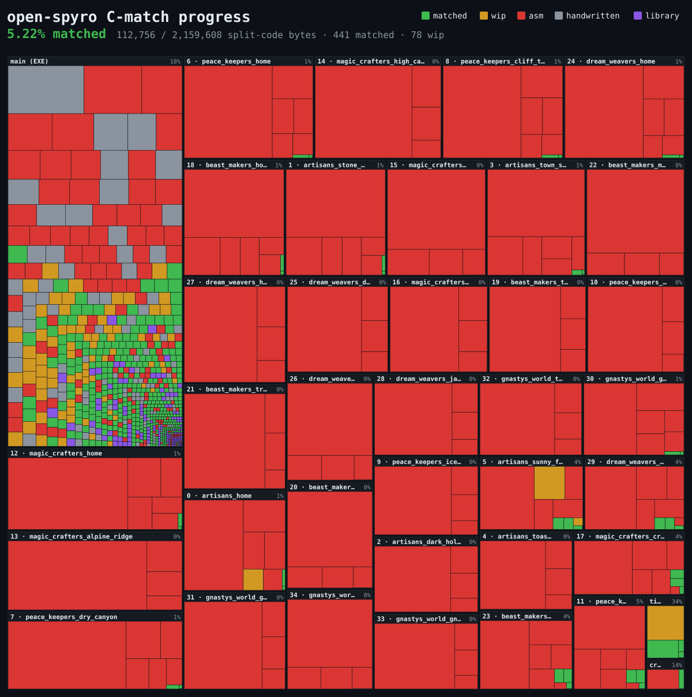

A byte-for-byte matching decompilation of
[Spyro the Dragon](https://en.wikipedia.org/wiki/Spyro_the_Dragon) _(PS1, NTSC,
`SCUS_942.28`)_. Every commit rebuilds the executable, all 37 overlays, and
`WAD.WAD` byte-identical to the original disc, and stays runnable in an
emulator. Functions not yet matched in C link in as the original assembly, so
progress is simply the fraction of code bytes expressed as verified-matching C.

 

</td>
<td width="50%" valign="top">

## [wasmdoom](https://github.com/theMagicalKarp/wasmdoom)

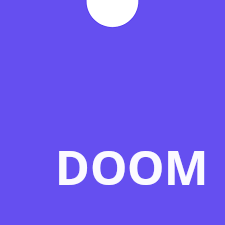

A small, portable WebAssembly build of the DOOM engine: a pure state machine you
feed inputs into and get video and audio out of, with little to no dependencies
to run. Play it at
[themagicalkarp.github.io/wasmdoom](https://themagicalkarp.github.io/wasmdoom/),
or check out
[wasmdoom-examples](https://github.com/theMagicalKarp/wasmdoom-examples) for
projects built on top of it, like emoji-doom, which plays DOOM in your terminal
rendered as emojis 😈.

 

</td>
</tr>
</table>

## [raytrace](https://github.com/theMagicalKarp/raytrace)

A CPU-based ray tracer written in Rust, built while working through the
[_Ray Tracing in One Weekend_](https://raytracing.github.io/) book series.
Scenes are defined in TOML and rendered from the command line.

  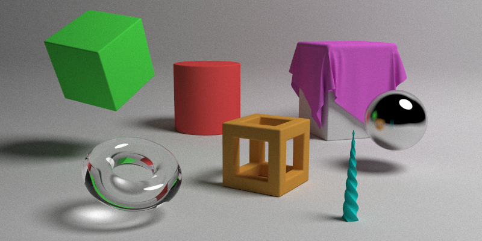

## [shaders](https://github.com/theMagicalKarp/shaders)

A collection of
[GLSL](https://www.khronos.org/opengl/wiki/OpenGL_Shading_Language) shaders
written to explore the rendering pipeline: ray marching, volumetric clouds, and
refraction with chromatic dispersion. Runs in the browser at
[shaders.sheehy.network](https://shaders.sheehy.network/).

  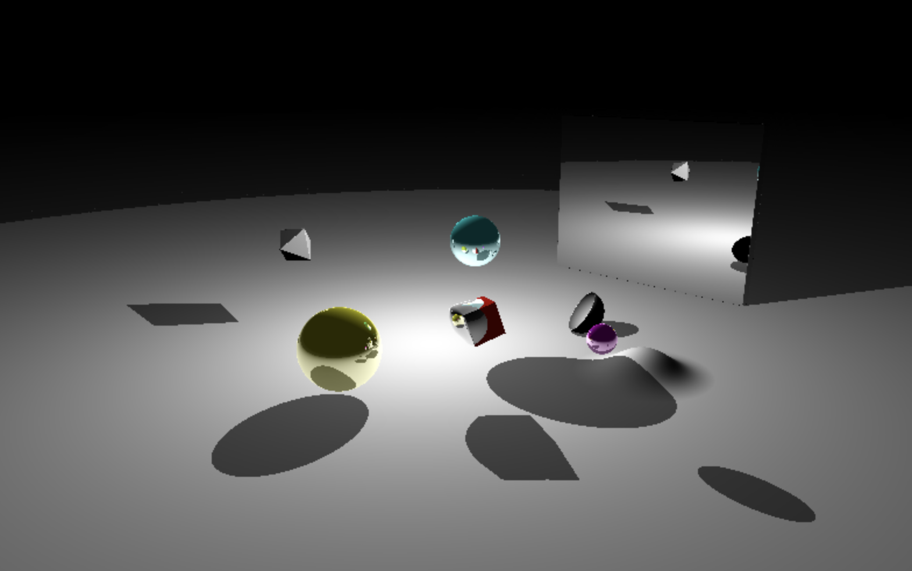
  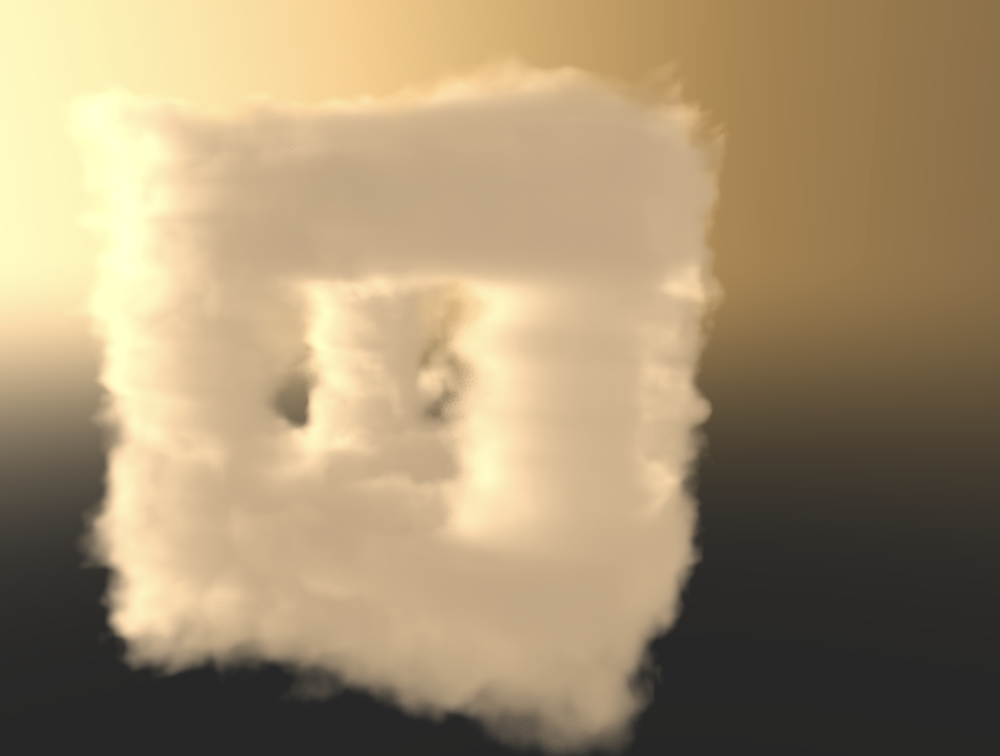
  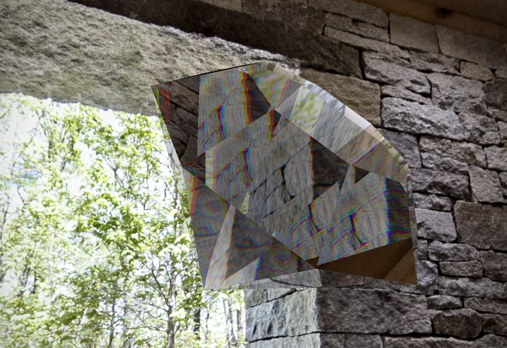

## [blender-portfolio](https://github.com/theMagicalKarp/blender-portfolio)

A running log of my [Blender](https://www.blender.org/) work: 3D modeling,
shading, and lighting studies made in short daily bursts since 2024. Each
project keeps its references alongside a sequence of renders, so the repo reads
as a progression rather than a gallery of finished pieces.

  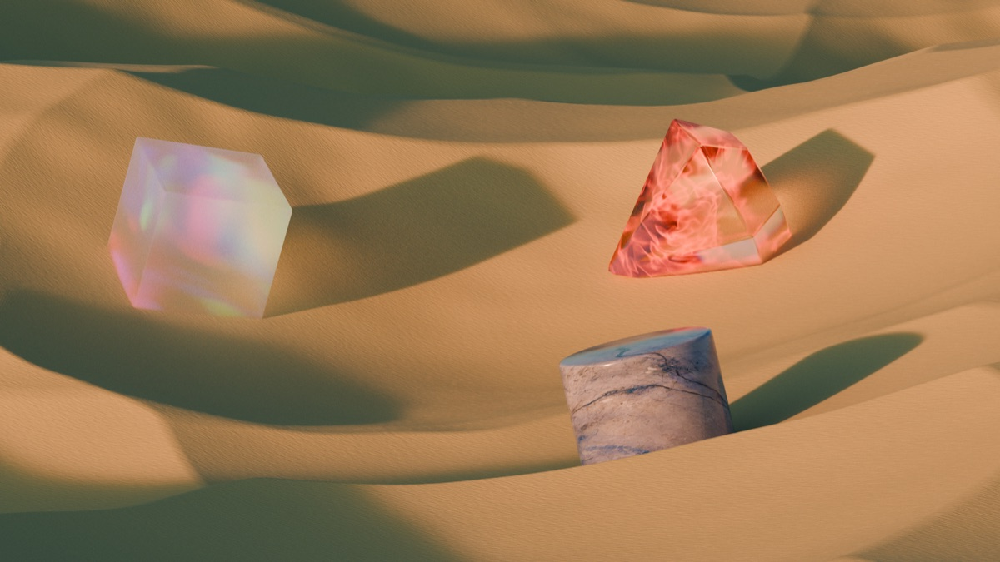
  
  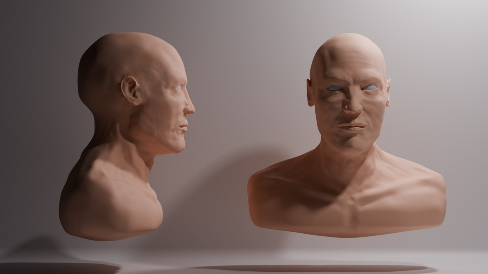

<table>
<tr>
<td width="50%" valign="top">

## [pokemon-emerald-refined](https://github.com/theMagicalKarp/pokemon-emerald-refined)

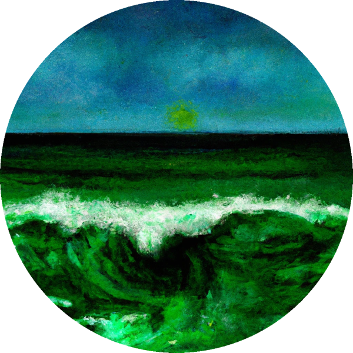

A Pokémon Emerald ROM hack built on the game's decompilation. Adds
quality-of-life improvements _(nature, EV, and IV display in the summary
screen)_, rebalanced moves, and increased challenge, while preserving the look
and feel of the original game.

 

</td>
<td width="50%" valign="top">

## [dithering](https://github.com/theMagicalKarp/dithering)

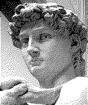

An implementation of
[Floyd–Steinberg dithering](https://en.wikipedia.org/wiki/Floyd%E2%80%93Steinberg_dithering)
in Go, reducing images to a limited palette by diffusing each pixel's
quantization error onto its neighbors.

 

</td>
</tr>
</table>

<table>
<tr>
<td width="50%" valign="top">

## [gameover](https://github.com/theMagicalKarp/gameover)

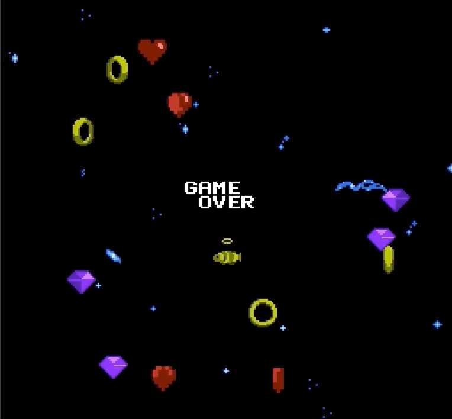

A NES demo written in 6502 assembly, built to learn how the NES actually works.
The ROM shows off basic graphics and audio capabilities, and you can play it in
your browser at [nes.sheehy.network](https://nes.sheehy.network/).

 

</td>
<td width="50%" valign="top">

## [donut](https://github.com/theMagicalKarp/donut)

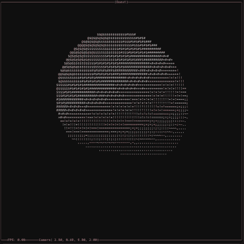

A [ray-marched](https://en.wikipedia.org/wiki/Ray_marching) 3D renderer that
runs entirely in your terminal, written in [Zig](https://ziglang.org/). Orbit
the camera, zoom, and flip between multiple animated scenes, all in ASCII.

 

</td>
</tr>
</table>

<table>
<tr>
<td width="50%" valign="top">

## [iter](https://github.com/theMagicalKarp/iter)

A _simple_ and _ergonomic_ Go library for implementing and using iterators.
Ships an easy-to-implement `Iterable` interface plus an itertools-style toolset
for working with them.

 

</td>
<td width="50%" valign="top">
</td>
</tr>
</table>
